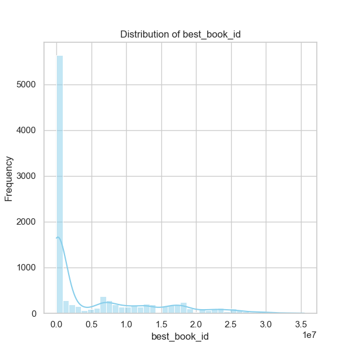
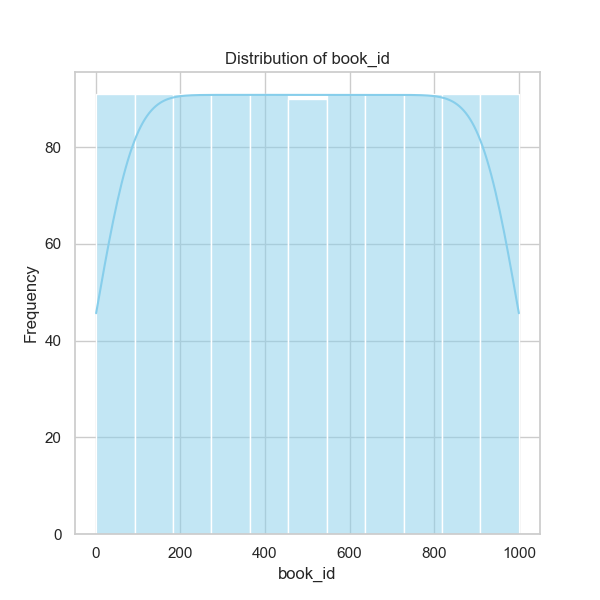
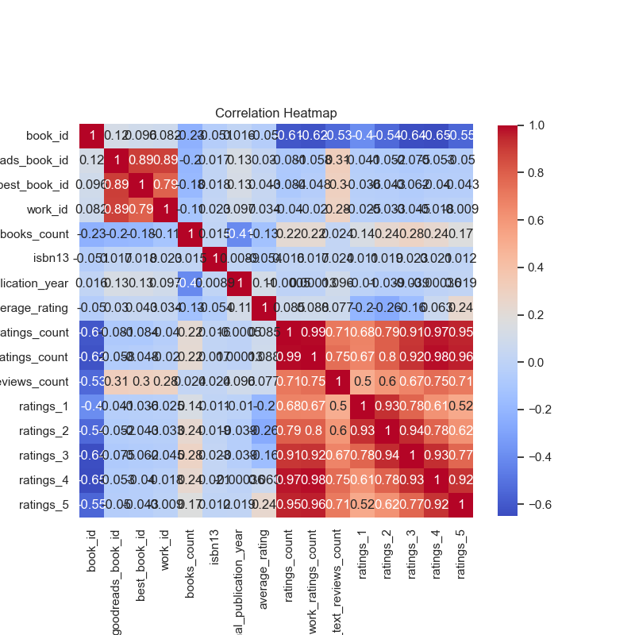
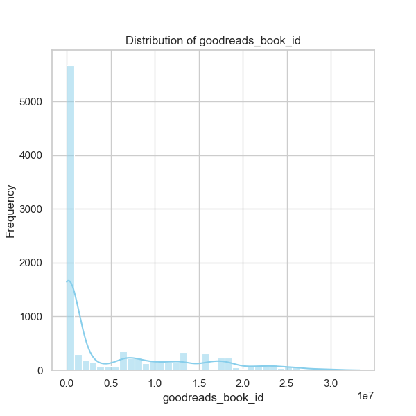

### Analysis of the Dataset

The dataset comprises 1000 books with various attributes, such as IDs, counts, author names, average ratings, and more. Here’s a structured analysis highlighting information about the dataset and what conclusions can be drawn.

#### 1. **Overview of Key Variables**
   - **Average Ratings:** The average rating across books is approximately **4.03** with a standard deviation of **0.23**, indicating generally positive reviews. The ratings range from **3.28 to 4.77**.
   - **Ratings Count:** The average ratings count per book is about **307,133** with significant variability (std = 416,507), suggesting considerable differences in the popularity and review volume of books.
   - **Distribution of Ratings:** Ratings are distributed across the scale (1-5), with an evident skew towards higher ratings (means of ratings 4 and 5 are significantly larger than 1 through 3).

#### 2. **Authors and Publication Year**
   - The dataset contains works from 646 unique authors, with "Stephen King" being the most frequent author (26 appearances). This concentration on certain authors suggests possible recommendations or trends in popular authorship.
   - The distribution of **original publication years** suggests a varied timeline, with an average of **1963**, indicating a significant number of older and possibly classic works in the dataset.

#### 3. **Correlation Insights**
   - There are strong correlations between different ratings categories: for instance, ratings 4 and 5 have correlations of **0.918** indicating that books rated highly tend to be heavily favored by reviewers.
   - Notably, there's a strong negative correlation between the number of ratings and both **work_ratings_count** (-0.623) and **average_rating** (-0.050), indicating that books with significantly higher review counts often have lower average ratings; suggesting a mix of elite and popular titles.

#### 4. **Missing Data Analysis**
   - Missing values are present in attributes such as `isbn`, `isbn13`, `original_publication_year`, and `language_code`. This missing data may affect analyses regarding book identification and categorization.
   - The fields with missing values could be handled by:
     - **Imputation**: For numerical fields like `original_publication_year`, impute with median or mode.
     - **Dropping**: Remove rows where essential categories (like `title`, `authors`) are missing.
     - **Flagging**: Create flags to indicate missing data in some features so that they can be considered in predictive models.

#### 5. **Outlier Considerations**
   - Look into extreme values in `ratings_count`, `work_ratings_count`, and `work_text_reviews_count`. For instance, there are books with ratings counts up to **4,780,653**, which could skew analysis.
   - Use methods like **Z-scores** or **IQR** based filtering to identify and handle outliers.

### Recommendations for Further Analysis
1. **Visualization Techniques:**
   - **Rating Distribution**: Create histograms or box plots to visualize the distribution of ratings, highlighting outliers and general trends.
   - **Authors vs. Average Ratings**: Scatter plots to show the relationship between the number of books by an author and their average ratings.
   - **Heatmap of Correlation**: A visual heatmap derived from the correlation matrix can highlight which factors are most strongly related.

2. **Predictive Modeling Techniques:**
   - **Linear Regression**: To predict average ratings based on features like authorship, publication year, and total ratings, while addressing potential multicollinearity.
   - **Classification Models**: Building models to classify the books into categories based on their rating scores could help in recommending similar books (e.g., Decision Trees, Random Forests).
   - **Content-Based Filtering for Recommendations**: Analyzing textual data from titles and authors for generating recommendations based on user preferences.

### Limitations
- Data may not be representative if the sample size is biased toward specific genres or authors.
- External factors influencing ratings (like marketing, trends) are not captured in the dataset, which could skew predictive analyses.
- The cultural context behind choices for books and ratings is not part of the dataset.

### Conclusion
This dataset presents a rich opportunity to analyze and derive insights into book ratings and reviews. The recommendations for further analysis will allow for deeper insights into user preferences and book performance, along with aiding in future predictions based on historical data. Proper handling of missing values and outliers will ensure more robust analyses and model performance.

