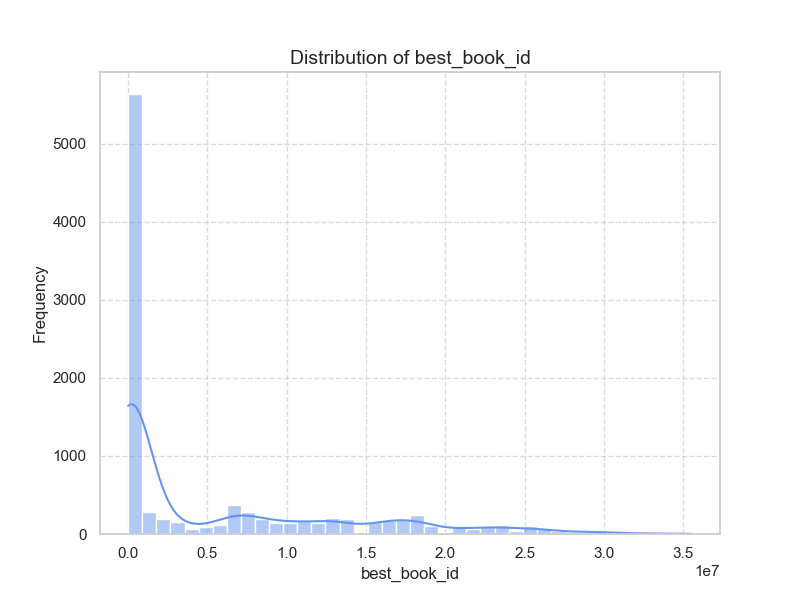

### Narrative Analysis of Goodreads Data

#### Overview
The dataset, derived from Goodreads, contains 10,000 entries with various attributes pertaining to books. This analysis reveals several insights regarding authorship, book ratings, publication years, and user engagement with the content.

#### Key Insights

1. **Authors and Popularity:**
   - The dataset includes 4,664 unique authors, with Stephen King being the most frequent contributor, having 60 entries. This suggests a potential concentration of reader attention on established authors, which could impact publisher decisions on marketing or promoting debut authors.

2. **Publication Years:**
   - The analysis indicates that the average original publication year of books is approximately **1982**. The latest published works in this dataset date back to **2017**, marking a significant span of literature represented. However, the minimum year of publication is noted as **-1750**, which may indicate inaccuracies or the inclusion of historical texts.

3. **Average Ratings and Count of Reviews:**
   - The average rating across the dataset is about **4.00**, with a maximum of **4.82**, highlighting generally positive reviews. There's a notable correlation (-0.38) between ratings count and work ratings count, indicating that books with more ratings tend to be evaluated differently, potentially due to confirmation bias or social influence on reviewer perceptions.

4. **Rating Distribution:**
   - The distribution of ratings (1 to 5 stars) shows that 5-star ratings are the most numerous, with an average of **23,789** ratings, while 1-star ratings average only **1,345**. This skewness towards higher ratings could suggest that users are less inclined to rate negatively, or there may be underlying biases in user engagement.

5. **Missing Values:**
   - There are notable missing values in several columns, particularly **ISBN** (700 missing) and **original_title** (585 missing). This could potentially lead to data integrity issues during analysis. 

6. **Language Representation:**
   - The dataset features 25 unique language codes, with English being the most represented. With **8,916 entries** confirmed in English, any analysis should consider the dominance of this language in assessing global readership trends.

7. **Books Count and Engagement:**
   - The average number of published works per book is approximately **75.71**, existing in a range from 1 to 3,455. This suggests a significant engagement from prolific authors, which can be pivotal for reader retention strategies.

#### Trends and Patterns
- **High Engagement Books:**
  - Books with a higher count of ratings and reviews tend to cluster around popular genres, which can inform potential marketing strategies for upcoming releases. Books attracting numerous reviews might warrant targeted promotional efforts.

- **Impact of Author Reputation:**
  - The correlation between certain metrics, such as book ratings, reviews, and authorship, alludes to an authorship trend that ties quality perceptions to writer reputation. This could advise publishers to leverage existing author names to enhance the visibility of new works.

#### Further Analyses Suggestions

1. **Clustering Analysis:**
   - Implementing clustering techniques (like K-means) based on numeric features (average ratings, ratings count, publication year) could reveal natural groupings of books that may not be immediately evident and offer insights on marketing or targeting specific reader demographics.

2. **Anomaly Detection:**
   - Anomaly detection could help identify outlier books with exceptionally low or high ratings compared to average ratings, which may warrant further exploration. Techniques like Isolation Forest or Local Outlier Factor could be employed.

3. **Predictive Modeling:**
   - Developing predictive models (e.g., regression analysis) to forecast future ratings based on past performance metrics could provide valuable insights into how upcoming books might perform.

4. **Trends Over Time:**
   - Time series analysis on publication years and average ratings could help ascertain the evolution of literary trends, revealing shifts in reader preferences over decades.

#### Strategic Implications
- **Publisher Decisions:**
  - Insights from this dataset could guide publishers to consider the impact of established authors on marketing strategies, while also not neglecting emerging voices in literature.
  
- **Reader Engagement:**
  - By recognizing trends in high-rating books, marketing campaigns could be tailored to foster new readership for similar genres or styles.

- **Data Quality Improvement:**
  - Addressing the missing data points promptly with data-cleaning techniques and enhancing data capture processes could improve the dataset's robustness for future analyses.

In conclusion, this analysis of the Goodreads dataset elucidates several telling patterns and trends within literary engagement and reader behaviors, offering avenues for strategic enhancements in publishing and marketing endeavors.

