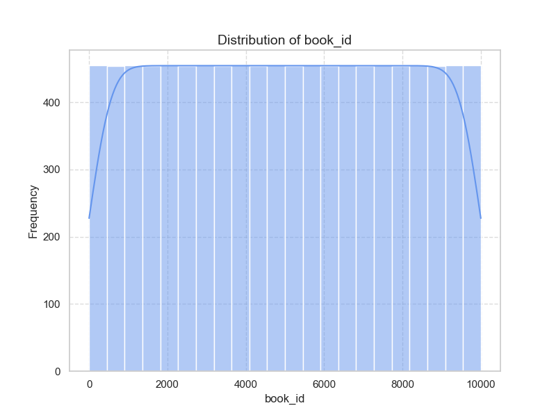
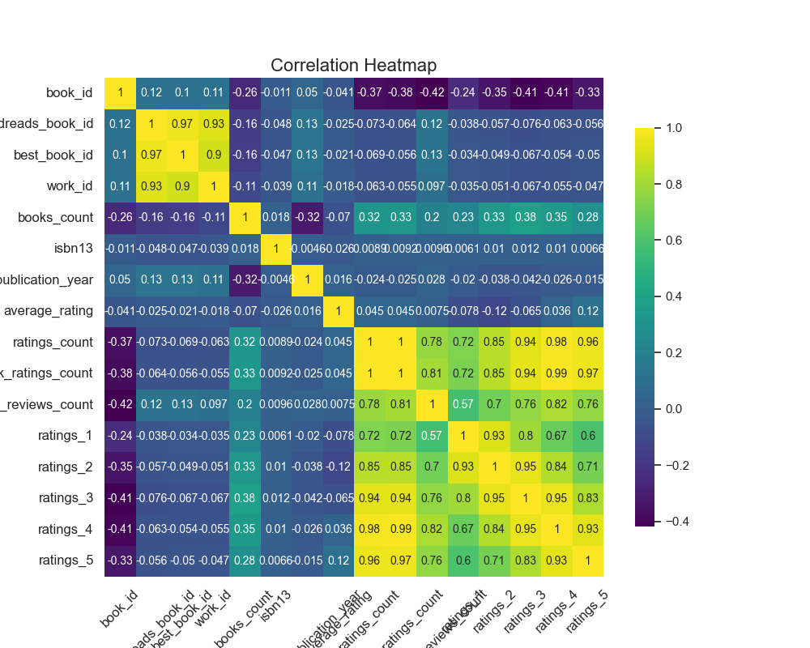

# Analysis Report

### Data Analysis Report

#### Actionable Insights

1. **Authors and Ratings:**
   - The dataset contains 646 unique authors, with Stephen King being the most frequently represented author (26 occurrences). Based on the average ratings and total ratings count, it may be beneficial to explore the relationship between the number of books an author has and their average ratings.
  
2. **Average Rating Analysis:**
   - The average rating of books is 4.03 with a standard deviation of 0.23. This indicates that most books have a high average rating. However, the distribution of ratings per category (1-5) reveals that the highest counts are in the 4-star and 5-star categories. This suggests a general tendency for readers to rate books positively. 

3. **Publication Year Trends:**
   - The original publication year shows a mean of approximately 1963 with a notable range, indicating a wide variety of books in the dataset, from classic literature to more contemporary works. Analyzing ratings in relation to the publication year could yield insights on how book popularity may change over time.

4. **Correlations:**
   - Strong negative correlations were observed between ratings counts and the average ratings (more ratings generally lead to lower average scores). There is also a strong correlation between `ratings_count` and `work_ratings_count`, suggesting that books with higher counts are more likely to have worked reviews and ratings.

5. **Language Distribution:**
   - The most common language code is English (eng), appearing 736 times in the dataset. If further analysis is needed, consider stratifying ratings analysis by language to pinpoint any trends.

#### Suggested Visualizations

1. **Distribution of Average Ratings:**
   - A histogram to show the distribution of average ratings can quickly highlight the rating tendencies among readers.

2. **Author Popularity:**
   - A bar chart depicting the number of books published by each author against the average ratings could reveal a pattern that successful authors maintain high ratings despite a large volume of works.

3. **Ratings Breakdown by Stars:**
   - A stacked bar chart can display the distribution of ratings (1-5 stars) across different books to visualize how many users rated each category.

4. **Publication Year vs. Average Rating:**
   - A scatter plot showing the years of publication against average ratings may reveal trends, e.g., newer books receiving different levels of popularity or ratings compared to older books.

5. **Correlation heatmap:**
   - A heatmap of the correlation matrix could visually convey relationships among numeric features.

#### Predictive Modeling Techniques

1. **Regression Models:**
   - Use linear regression or polynomial regression to predict average ratings based on features such as `ratings_count`, `work_ratings_count`, and `books_count`.

2. **Classification Models:**
   - Implement classification algorithms (e.g., logistic regression, decision trees) to classify books into rating categories based on features like publication year or author presence.

3. **Collaborative Filtering:**
   - If you can obtain user ratings, collaborative filtering techniques (user-based or item-based) can be used to recommend books based on similarity to books rated by users.

4. **Random Forests:**
   - Because of their ability to handle nonlinear relationships and interactions between features, Random Forest models could effectively predict ratings and uncover patterns in a high-dimensional dataset.

#### Handling Missing Data

- **Imputation Strategies:**
  - Data imputation for categorical variables, such as filling missing `isbn` or `language_code` entries with the mode (most frequent value).
  - For numerical variables like `isbn13` and `original_publication_year`, consider using the median or statistical imputation techniques based on similar data points.

- **Dropping Columns:**
  - Columns with excessive missing values (e.g., `original_title` with 20 missing entries) may be considered for removal, depending on their relevance to the analysis.

#### Handling Outliers

- **Outlier Detection:**
  - Implement techniques such as the IQR (Interquartile Range) method or Z-scores to identify outliers in numeric fields like `average_rating`, `ratings_count`, etc.

- **Treatment Options:**
  - For continuous variables, consider capping outliers or transforming the data using logarithmic scaling to reduce the impact of extreme values.
  - Analyze outliers to determine if they represent legitimate data points needing special consideration or errors that can be corrected.

### Conclusion

A comprehensive analysis of the book dataset reveals patterns in user ratings, author performance, and trends over publication years. By implementing the suggested visualizations, predictive modeling techniques, and addressing missing data and outlier treatment, we can derive deeper insights into book popularity and reader preferences.

## Visualizations

