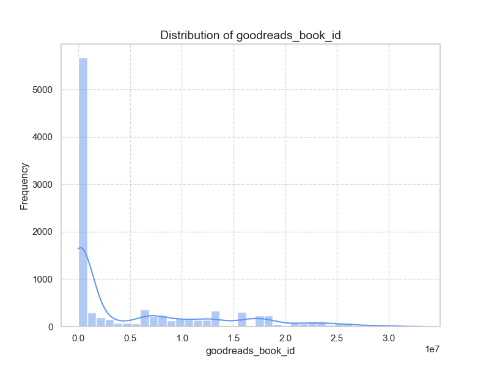

Based on the provided dataset from Goodreads, we can derive several insights and make recommendations for further analysis, visualization, and predictive modeling. Below are the key points and suggestions:

### Dataset Overview

1. **Data Structure**:
   - The dataset contains 10,000 entries with various features such as book IDs, authors, publication years, ratings, and text reviews counts.
   - Key metrics include `average_rating`, `ratings_count`, and `work_text_reviews_count`.

2. **Missing Data**:
   - Common columns with missing values include `isbn` (700), `isbn13` (585), `original_publication_year` (21), `original_title` (585), and `language_code` (1084).
   - The `isbn` and `isbn13` fields have significant missing values, which may impact linking with external datasets.

3. **Unique Values and Top Authors**:
   - There are 4664 unique authors, with 'Stephen King' being the most frequently occurring author (60 occurrences). This could lead to an analysis of author's impact on ratings.

4. **Rating Distribution**:
   - Average ratings are generally high (mean = 4.00) with a maximum of 4.82. This points to a generally positive reception for the books.
   - Count of ratings shows some books receive massive amounts of feedback (e.g., `ratings_count` max: 4,780,653).

### Insightful Analyses to Conduct

1. **Trends Over Time**:
   - Analyze how the `average_rating` and `ratings_count` change over time based on the `original_publication_year`. This can help identify trends in reader preferences.

2. **Author Influence on Ratings**:
   - Investigate how different authors impact the average ratings and total ratings. This can be done using a grouped analysis or visualization.

3. **Language Analysis**:
   - Analyze the distribution of books across different languages and their ratings. This can reveal which languages have higher-rated literature.

4. **Correlation Analysis**:
   - Examine correlations between `average_rating`, `ratings_count`, and `work_text_reviews_count`. High correlations may indicate that books with more ratings tend to have higher average ratings. 

5. **Sentiment Analysis on Reviews**:
   - If full reviews were available, performing sentiment analysis could provide insights into whether sentiment correlates with ratings.

### Visualization Techniques

1. **Bar Graphs**:
   - Create bar charts to show the average rating by author or by language to highlight how certain authors or languages perform.
   
2. **Time Series Plots**:
   - Construct time series plots to visualize trends in average ratings and ratings counts over the years.

3. **Heatmaps**:
   - Use heatmaps to represent correlations between different rating counts and other numerical variables.

4. **Histograms**:
   - Create histograms for the distribution of `average_rating`, `ratings_count`, and `work_text_reviews_count` to understand the spread effectively.

### Predictive Modeling

1. **Modeling Average Rating**:
   - Develop regression models (linear regression, decision trees) to predict the average rating of books based on independent variables such as author, year of publication, and `ratings_count`.

2. **Classification Models**:
   - Classify books into categories (e.g., bestsellers vs. low performers) based on `average_rating` and `ratings_count` using logistic regression or random forests.

### Handling Missing Data and Outliers

1. **Missing Values**:
   - **Imputation**: Use mean/median or mode (for categorical) to fill gaps in numeric fields, especially for `original_publication_year`. Consider using a model-based approach or predictive algorithms (e.g., k-NN imputation).
   - **Removal**: If the number of missing values is negligible compared to total data (like in `original_publication_year`), simply removing those rows may be feasible.

2. **Outliers**:
   - Analyze metrics like `ratings_count` for potential outliers (using IQR or Z-scores).
   - Consider the effect of outliers on your analysis, including whether to transform (e.g., log transformation) or truncate them to avoid skewing results.

### Limitations

- The dataset might be biased towards more popular or reviewed books, leading to skewed average ratings.
- Missing ISBN data can limit the ability to cross-reference with other databases.
- A lack of qualitative review data limits potential insights from sentiments of the readers.

By following these recommendations for further analysis, visualization, and predictive modeling, one can extract deeper insights from the Goodreads dataset while ensuring to address the limitations posed by missing data and outliers effectively.

### Visualizations:

