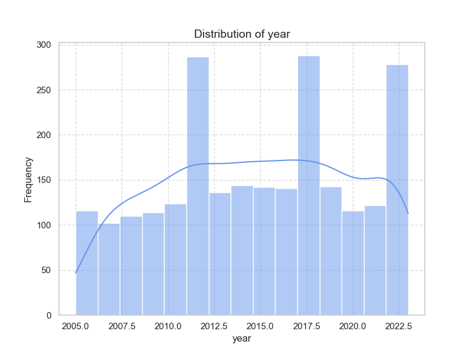

### Dataset Analysis

The dataset encompasses various metrics related to well-being and social factors across 71 countries from 2005 to 2023. It includes indicators such as the Life Ladder, GDP per capita, social support, healthy life expectancy, freedom to choose life paths, generosity, perceptions of corruption, and emotional well-being indicators (positive and negative affect).

#### Summary of Findings

1. **Key Indicators**:
   - **Life Ladder**: The mean score is approximately 5.53 with a standard deviation of about 1.19. This suggests a generally moderate perception of life satisfaction among respondents, but with notable variability. The maximum value is 8.019, indicating that some individuals report high life satisfaction.
   - **Log GDP per Capita**: With a mean of 9.46, this logarithmic scale indicates variability in economic development among the countries included. There's a strong correlation (0.77) with the Life Ladder, suggesting that economic factors significantly impact life satisfaction.
   - **Social Support**: The mean score here is 0.79, suggesting that respondents generally feel supported socially. This metric shows a strong correlation (0.78) with the Life Ladder as well, highlighting its importance in contributing to subjective well-being.
   - **Healthy Life Expectancy**: On average, this is about 63.68 years, with a maximum of 73.2 years, indicating disparities in health outcomes among countries.
   - **Freedom to Make Life Choices**: This metric has a mean of 0.75 and is positively correlated (0.57) with the Life Ladder, indicating that perceptions of autonomy strongly associate with higher life satisfaction.
   - **Generosity and Perceptions of Corruption**: These variables have notably low average values, with perceptions of corruption showing a negative correlation with life satisfaction (-0.47), suggesting that higher corruption perceptions correspond with lower life satisfaction.

2. **Correlation Insights**:
   - Strong positive correlations are found between life satisfaction and metrics such as Log GDP per capita, social support, healthy life expectancy, freedom to choose life paths, and positive affect.
   - Negative correlations exist between life satisfaction and factors like perceptions of corruption and negative affect, indicating that these negatively impact people's well-being.

3. **Missing Values**: The dataset has some missing values across various columns, with Generosity and Perceptions of Corruption being particularly affected (28 and 38 missing values respectively). This could introduce bias in analyses due to reduced dataset size.

4. **Potential Outliers**: The range of values for several metrics (e.g., Life Ladder and GDP per capita) could include outliers that may skew the results. Conducting an outlier analysis would help identify extreme values and decide on methods for treatment, whether to exclude, cap, or analyze separately.

### Recommendations for Further Analysis

1. **Visualizations**:
   - **Correlation Heatmaps**: A heatmap can visually display the correlation matrix, helping to identify and communicate relationships between variables easily.
   - **Box Plots**: To check for outliers effectively across key well-being metrics like Life Ladder and GDP per capita.
   - **Time Series Analysis**: Trends in the Life Ladder over years can be visualized using line charts, particularly to observe changes in well-being against changing economic indicators.

2. **Predictive Modeling Techniques**:
   - **Regression Analysis**: Employ linear regression to predict Life Ladder scores using Log GDP, Social Support, Freedom to Choose, etc. Modeling can also account for the impacts of perceptions of corruption on well-being.
   - **Machine Learning Models**: Consider implementing decision trees, random forests, or gradient boosting for more robust predictive insights. These can handle non-linear relationships and interactions between predictors better than simple linear models.
   - **Clustering**: Group countries based on similar characteristics of well-being metrics using clustering algorithms (like K-means) to provide insights into different clusters of countries (e.g., high well-being vs. low well-being).

3. **Handling Missing Data**:
   - Use imputation techniques for continuity. Options include mean/mode imputation or more sophisticated methods like K-nearest neighbors (KNN) for certain variables.
   - Analyze whether the missingness is random or could introduce bias—if not random, consider collecting further data or flagging variables as potentially compromised.

4. **Further Limitations**:
   - **Temporal Changes**: Changes in political, social, or economic conditions over time in a specific country may affect the data variably. Contextual information about major events during the years covered would deepen the insights.
   - **Generalizability**: As only 71 countries are represented, generalizing findings to all nations may not be feasible. Scope to include a broader or more representative sample among various income and cultural groups would enhance analysis validity.

### Conclusion

The dataset provides rich insights into the interplay between economic, social, and health indicators and their relationship with subjective well-being. Recommendations for visualization, predictive modeling, and addressing data limitations will enhance further analysis and help in developing actionable insights for policy and program interventions targeting improved well-being outcomes globally.

