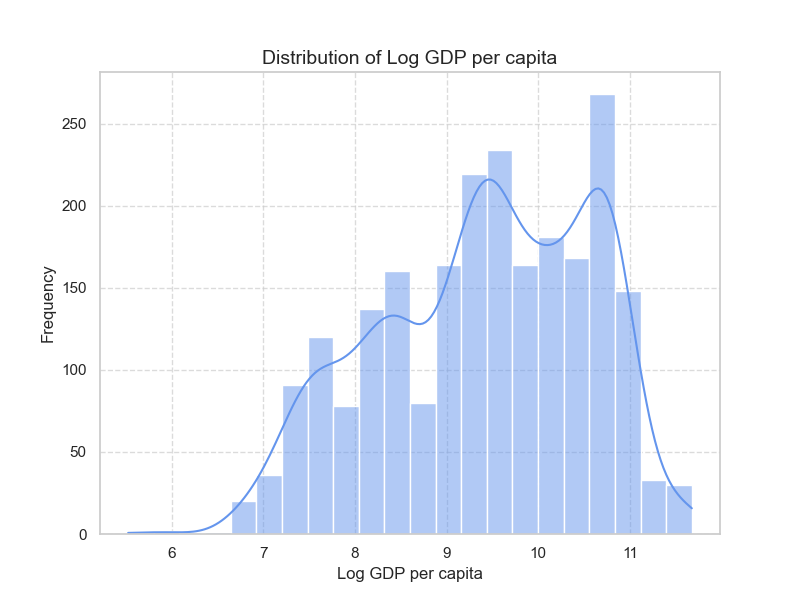

Based on the statistical summary, correlations, and data descriptions provided from the 'happiness.csv' file, we can identify several key trends and potential areas for further analysis:

### General Trends

1. **Country Representation**:
   - A total of 2363 entries for 165 unique countries indicates a diverse dataset. Argentina appears most frequently with 18 entries, which suggests a significant focus on this country in the dataset.

2. **Time Frame**:
   - The dataset spans from 2005 to 2023, with a mean year around 2014.76, pointing to a relatively balanced representation of years, predominantly around the mid-2010s.

3. **Happiness Metrics (Life Ladder)**:
   - The mean score of the 'Life Ladder' is around 5.48, with a standard deviation of approximately 1.13. This indicates a moderate level of happiness globally, but with considerable variance.
   - The Life Ladder score ranges from 1.281 to 8.019, showing that some countries are significantly happier than others.

4. **Economic Indicators (Log GDP per Capita)**:
   - The 'Log GDP per capita' has a mean of about 9.4, suggesting a reasonable correlation between economic status and happiness. However, there are 28 missing values which may affect the reliability of this insight.
   - There’s a strong correlation between GDP and the 'Life Ladder' score (0.78), indicating economic factors heavily influence perceived well-being.

5. **Social Support and Health**:
   - 'Social support' has an average of around 0.81, suggesting moderate social connectivity, which is positively correlated with happiness.
   - A healthy life expectancy of about 63.4 years indicates a significant public health aspect that may also influence happiness levels. There are 63 missing values in this column.

6. **Freedom and Choices**:
   - The metric for 'Freedom to make life choices' has a mean of approximately 0.75, which indicates a relatively impactful degree of personal freedom, correlating with happiness (correlation of 0.54).

7. **Affect Metrics**:
   - Positive affect averages at around 0.65 with a low negative correlation to negative affect (0.27), suggesting that more positive experiences are generally reported than negative ones.
   - 'Positive affect' shows a correlation of 0.52 with the 'Life Ladder', indicating that emotional well-being is integral to overall happiness.

8. **Perceptions of Corruption**:
   - A mean score of about 0.74 for perceptions of corruption with a negative correlation to happiness (other metrics) suggests that countries perceived as corrupt tend to report lower happiness.

### Areas Needing Further Analysis

1. **Missing Data Analysis**:
   - With missing values in key variables (e.g., Log GDP per capita, Healthy life expectancy at birth, etc.), it is crucial to investigate the potential impacts of these missing entries on overall analysis and conclusions.

2. **Correlations and Causations**:
   - While correlations (e.g., happiness and GDP, social support) are noted, further analysis, such as regression modeling, could clarify causative relationships and control for confounding variables.

3. **Regional Differences**:
   - Analyzing data geographically to discern trends among various regions may provide insights into how cultural, economic, and social factors influence happiness.

4. **Temporal Changes**:
   - Given the range from 2005 to 2023, it would be insightful to delve into how happiness levels have changed over time, particularly before and after major global events like economic crises or pandemics.

5. **Influence of Generosity and Corruption**:
   - The observed low mean in 'Generosity' and significant correlations with both happiness and perceptions of corruption suggest a need to further explore these emotions and their impact on overall well-being.

6. **Comparative Analysis**:
   - Compare happiness metrics between countries with similar GDP levels to identify possible external factors influencing happiness that may not be accounted for purely by economic measures.

### Conclusion

The data reflects complex relationships between happiness and various socio-economic factors. More detailed examination into the missing data, correlations, and broader socio-cultural contexts will be beneficial for drawing more comprehensive conclusions about global happiness trends.

Based on the provided correlation matrix, several key variables exhibit significant correlations with others. Let's analyze some of these key variables and their potential causal relationships:

### Key Variables and Correlations

1. **Life Ladder**
   - Strong positive correlation with:
     - **Log GDP per capita** (0.78)
     - **Social support** (0.72)
     - **Healthy life expectancy at birth** (0.71)
     - **Freedom to make life choices** (0.54)
     - **Positive affect** (0.52)
   - Negative correlation with:
     - **Perceptions of corruption** (-0.43)
     - **Negative affect** (-0.35)

2. **Log GDP per capita**
   - Strong positive correlation with:
     - **Healthy life expectancy at birth** (0.82)
     - **Social support** (0.69)
     - **Life Ladder** (0.78)
   - Negative correlation with:
     - **Perceptions of corruption** (-0.35)
     - **Negative affect** (-0.26)

3. **Social Support**
   - Strong positive correlation with:
     - **Life Ladder** (0.72)
     - **Log GDP per capita** (0.69)
     - **Positive affect** (0.42)
   - Negative correlation with:
     - **Negative affect** (-0.45)
     - **Perceptions of corruption** (-0.22)

4. **Freedom to make life choices**
   - Strong positive correlation with:
     - **Life Ladder** (0.54)
     - **Positive affect** (0.58)
   - Negative correlation with:
     - **Perceptions of corruption** (-0.47)
     - **Negative affect** (-0.28)

5. **Perceptions of Corruption**
   - Strong negative correlation with:
     - **Life Ladder** (-0.43)
     - **Freedom to make life choices** (-0.47)

6. **Positive Affect**
   - Strong positive correlation with:
     - **Life Ladder** (0.52)
     - **Freedom to make life choices** (0.58)
   - Negative correlation with:
     - **Negative affect** (-0.33)

### Suggested Causal Relationships

Based on these correlations, we can propose several possible causal relationships:

1. **Economic Factors to Well-being**
   - Higher **Log GDP per capita** may lead to an increase in **Life Ladder** scores, suggesting that greater wealth contributes to better perceived well-being and happiness. This might be due to increased access to resources, better health care, and overall improved living conditions.

2. **Health and Life Satisfaction**
   - Higher **Healthy life expectancy at birth** is likely to contribute positively to the **Life Ladder** score. As people live healthier and longer lives, they may report higher life satisfaction and happiness.

3. **Social Connections and Support**
   - Increased **Social support** can lead to higher **Positive affect** and elevated scores in the **Life Ladder**. This suggests that social and community connections may enhance individuals' perceptions of happiness and well-being.

4. **Empowerment and Freedom**
   - The ability to make choices (measured by **Freedom to make life choices**) appears to play a crucial role in influencing **Life Ladder** scores and **Positive affect**. Individuals who feel they have control over their lives may report higher happiness and satisfaction levels.

5. **Negative Affect and Corruption**
   - Higher **Perceptions of corruption** can negatively impact happiness measures like the **Life Ladder** and increase **Negative affect**. This indicates that a lack of trust in government or institutions might lead to decreased happiness and feelings of distress.

6. **Positive and Negative Affect**
   - A strong negative relationship between **Positive affect** and **Negative affect** highlights that as individuals experience more positive emotions or states, they tend to report lower levels of negative emotions. This relationship suggests an emotional balancing effect where fostering positive experiences can mitigate negative feelings.

### Conclusion

These correlations indicate intricate interdependencies between economic factors, social connections, health, freedom, and perceptions of corruption. The suggested causal relationships emphasize the importance of improving economic conditions, healthcare, social support, and reducing corruption to enhance overall well-being. Future research could employ longitudinal studies or experimental methods to further investigate these causal pathways.

