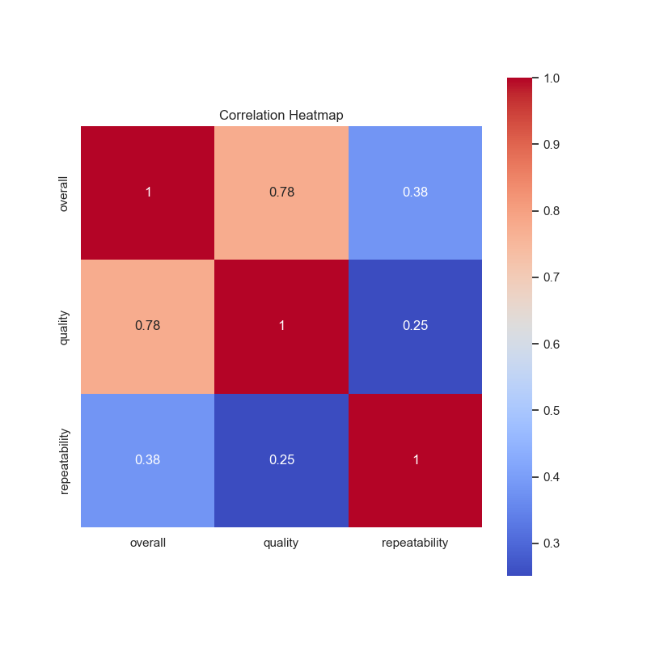
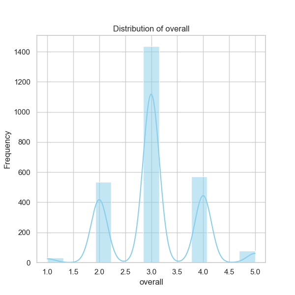
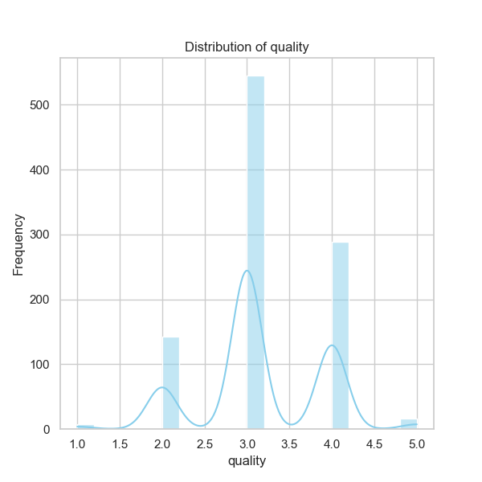
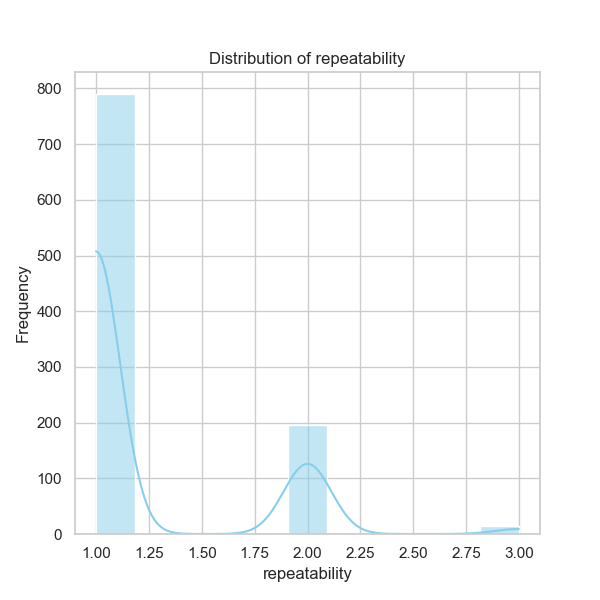

Based on the analysis of the dataset 'media.csv', we can extract a comprehensive narrative reflecting trends, insights, and potential future actions. Let's dive into the detailed examination.

### 1. Overview of the Dataset
The dataset contains a total of **2652 records** with attributes that include dates, languages, media types, titles, authors, and various ratings. The dataset appears to be robust, given it comprises a spectrum of languages and media types.

### 2. Column-wise Insights

#### **Date Trends**
- **Unique Entries**: There are **2055 unique dates**. The most frequently recorded date is **21-May-2006**, occurring **8 times**. However, **99 records are missing dates**, indicating potential gaps in the data collection that might obscure temporal analysis, such as trends over time or seasonality.

#### **Language Distribution**
- The dataset is primarily dominated by **English**, with **1306 entries** (approximately 49% of total entries) and **11 unique languages**. This hints at a market orientation that may favor English-speaking audiences. The diversity in language may target multilingual audiences, although the predominant English content suggests a need for localized marketing strategies if translations are required for global outreach.

#### **Type of Media**
- Media types are predominantly marked as **movies** (2211 entries), with only **8 unique types** total. This indicates a strong focus on cinematic content, suggesting consumer preferences for movies over other forms like series, documentaries, etc. Understanding the other types of media represented could inform cross-promotion strategies.

#### **Title Popularity**
- The title **"Kanda Naal Mudhal"** is the most frequent, occurring ***9 times*** out of **2312 unique titles**. This title could be further investigated to understand its success factors—was it a part of marketing campaigns or notable events that contributed to its visibility?

#### **Contributors**
- The top contributor is **Kiefer Sutherland** with **48 appearances**, implying that content by this contributor represents a significant share and might attract fans of their work. However, with **262 missing values** in the 'by' column (representing the contributor’s names), it suggests a need to ensure that future data collection efforts properly attribute all content for comprehensive storytelling and analysis.

### 3. Rating Analysis
#### **Overall Ratings**
- The average overall rating stands at **3.05** (on a scale of 1 to 5), with ratings typically concentrated around the middle range (25th and 50th percentiles at **3**). 

#### **Quality Ratings**
- The quality ratings average to **3.21**, indicating a generally favorable perception of quality although it is notably close to the average overall rating. This suggests that while content may not necessarily be deemed exceptional, it garners a satisfactory response from viewers. 

#### **Repeatability Ratings**
- The mean repeatability rating is at **1.49**, revealing that most media content likely does not have a strong tendency for repeated viewing, typically averaging close to "1" which implies that very few users find the content worth revisiting.

### 4. Correlation Insights
From the correlation matrix, we observe:
- **Overall Ratings and Quality Ratings** correlate strongly (**0.826**) while the correlation between **overall and repeatability** is moderate (**0.513**). High-quality content leads to better overall ratings, while lower repeatability suggests that content may not have lasting appeal among viewers, potentially indicating either a one-time viewing satisfaction or a lack of depth in engagement.

### 5. Suggested Further Analyses
To deepen our understanding of this dataset, consider:
- **Clustering Analysis**: Implementing clustering algorithms like K-Means could uncover patterns relative to viewer preferences based on media type and ratings, which can be instrumental in segmenting the viewer base for targeted marketing efforts.
  
- **Anomaly Detection**: Identifying anomalies in media ratings could highlight content that either exceeded viewer expectations or failed to resonate in unforeseen ways, thus offering crucial lessons on what drives engagement.

- **Temporal Analysis**: Filling in the missing date values and conducting a time series analysis can help reveal trends over time, identifying peak periods for releases or specific content types that align with seasonal events or trends.

### 6. Implications for Future Decisions
Insights from this analysis suggest a few critical actions:
- **Content Strategy Adjustments**: Given the trends in media preferences, an increased focus on high-quality cinematic productions in English may be beneficial, while also exploring diverse types of media to capture interest in less saturated areas.
  
- **Marketing Initiatives**: Partnering with top creators like Kiefer Sutherland could amplify marketing strategies and capitalizing on their fanbase to promote upcoming titles.

- **Engagement Tactics**: Develop strategies aimed at improving repeatability—such as targeted campaigns or supplementary content for viewers likely to return to popular titles.

In summary, the analysis of 'media.csv' lays a rich foundation for understanding the dynamics of viewer preferences, content quality, and trends, providing actionable insights that can inform strategic decisions in content development, marketing, and audience engagement moving forward.

