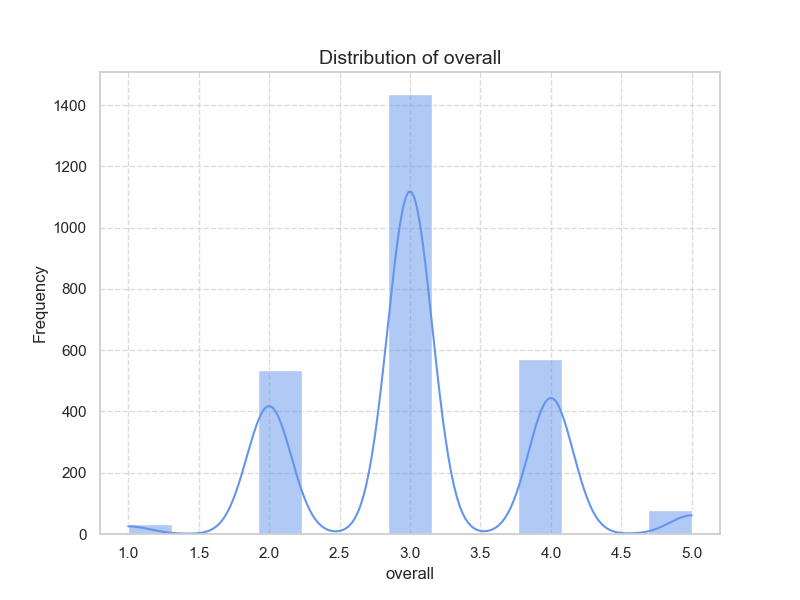

### Analysis of the Dataset

This dataset consists of 1,000 entries describing various items categorized by date, language, type, title, contributor, and quantitative metrics such as overall ratings, quality ratings, and repeatability scores.

#### Key Insights:

1. **Data Composition**:
   - There are **8 unique languages**, with **English** being the most prevalent (395 occurrences).
   - The predominant **type** of entries is **movies**, accounting for **794** out of **1,000** entries.

2. **Title Distribution**:
   - A total of **918 unique titles** exist, indicating a diverse set of items.
   - The most common title is **"Don"**, which appears 4 times.

3. **Contributors**:
   - **873** contributors are present in the dataset, with **Kiefer Sutherland** having the highest frequency (47 entries).

4. **Ratings**:
   - **Overall Ratings**: The average overall rating is **2.903** (with a standard deviation of **0.657**), suggesting a tendency towards lower scores.
   - **Quality Ratings**: The mean quality rating is **3.161** and has relatively higher variability, suggesting greater divergence in user perceptions of quality.
   - **Repeatability Scores**: The average score is **1.224**, with most values concentrated at the minimum score of **1** (this could indicate a weak or poor repeatability of the items being rated).

5. **Correlation**:
   - There is a strong positive correlation between **overall ratings** and **quality ratings** (**0.775**), indicating that higher quality ratings likely lead to higher overall ratings.
   - The correlation between **repeatability** and the other two metrics is weaker, suggesting repeatability may not significantly influence perceived quality or overall satisfaction.

#### Recommendations for Further Analysis:

1. **Missing Data Management**:
   - **"by" Column**: With 127 missing entries, consider either imputing this data if possible or analyzing the impact of missing data on overall trends.
   - One approach could include filling missing values with the mode or nearest neighbor approaches based on other attributes.

2. **Outlier Detection**:
   - Given the overall ratings and quality metrics, exploring the data for outliers (particularly in the repeatability score where the max is only 3) is essential. Methods such as IQR, Z-score, or visualizations like box plots could help identify and decide whether to remove or keep those data points.

3. **Visualizations**:
   - Create histograms or density plots for overall, quality, and repeatability scores to understand their distributions.
   - Use a heatmap to visualize the correlation matrix for better intuitiveness.
   - Show the distribution of ratings by language and type to identify trends or patterns across categories over time.

4. **Predictive Modeling**:
   - Consider regression analysis to predict overall ratings based on quality and repeatability metrics, which could be useful for evaluating item success factors.
   - Classification algorithms can also be applied to predict categories of `by` or `type` based on the mentioned ratings.

5. **Temporal Analysis**:
   - If appropriate, data could be segmented by date ranges to investigate trends over time in overall, quality, or repeatability ratings.
   - Time series analysis could provide insights into how ratings evolve.

6. **User Behavior Analysis**:
   - Investigate whether certain contributors contribute higher quality or overall scores, which might inform potential recommendations or collaborations.

#### Limitations to Consider:

- **Sample Size**: Although 1,000 entries seem reasonable, it would be helpful to ensure representation across unique languages and types.
- **Subjectivity of Ratings**: The ratings are inherently subjective, leading to variability in personal perceptions that may not reflect true quality.
- **Normalization of Ratings**: Consider normalizing ratings if necessary, especially if any external factors (like scoring systems) might differ.

Implementing these recommendations could provide a deeper understanding of the dataset and offer actionable insights into the elements that contribute to overall success in this domain.

