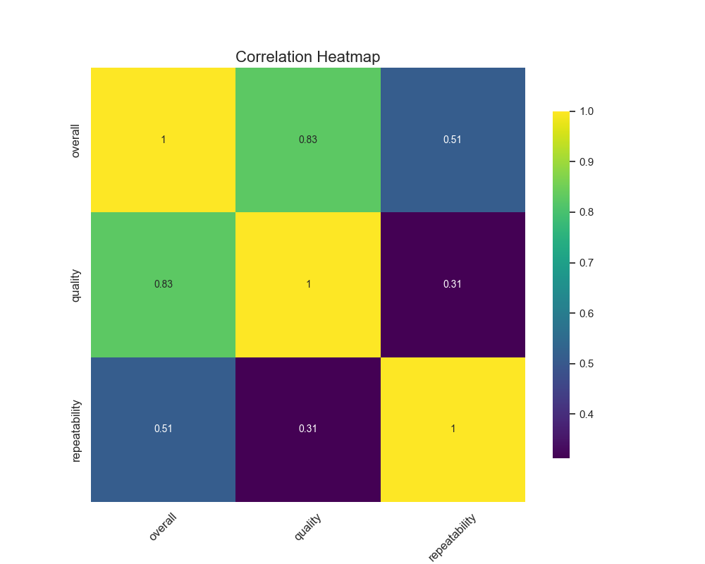

# Analysis Report

### Data Analysis Report: Insights, Visualizations, and Prediction Approaches

#### Actionable Insights

1. **Review and Improve User Contribution**:
   - The dataset contains a significant contributor named Kiefer Sutherland, who has 47 reviews. Insights from his reviews can be analyzed deeper for potential partnerships or promotional activities.
   - With 583 entries by other users unaccounted for various reasons, analyzing their contributions may reveal common themes or issues influencing user engagement.

2. **Language and Content Type Preference**:
   - A predominant portion of the dataset is in English (395 reviews), and 'movie' is the most common type (794 entries). These insights suggest a targeted strategy for English-language movie promotions and user engagement initiatives in this genre.
   - A minority of other languages should be explored further for niche targeting or possible content expansion.

3. **Quality and Overall Ratings**:
   - The overall rating has a mean of 2.903 and a moderate standard deviation (0.657), suggesting variance in user satisfaction. Given that the majority of quality scores center around 3 and 4, suggesting many reviews fall into mid to high-quality segments, companies should emphasize gathering more positive user feedback.
   - A correlation of 0.775 between quality and overall suggests that users perceive higher quality content favorably. Strategies to elevate perceived quality could improve overall ratings.

4. **Repeatability Signals**:
   - The low repeatability mean (1.224) indicates that users do not frequently leave multiple reviews, reflecting either a lack of continued engagement or perhaps the need for improvements in satisfaction to encourage repeated contributions. Targeted behavioral strategies (e.g., reminder emails, incentives) could increase repeat reviews.

#### Recommended Visualizations

1. **Time Series Analysis**:  
   Visualize the number of reviews over time to identify trends or seasonal patterns. A line plot can demonstrate periods of increased activity (e.g., during movie releases or public events).

2. **Distribution of Ratings**:  
   Create histograms for `overall`, `quality`, and `repeatability` ratings to understand user sentiments. This can help reveal skewness in ratings distribution.

3. **Language and Type Breakdown**:  
   A bar chart representing the count of reviews by language and type could indicate user preferences and highlight content gaps.

4. **Correlation Heatmap**:  
   A heatmap to visualize correlations among `overall`, `quality`, and `repeatability`, emphasizing their relationships and identifying potential areas for improvement.

#### Suggested Predictive Modeling Techniques

1. **Regression Analysis**:  
   Utilize multiple linear regression or polynomial regression to predict overall ratings based on quality and repeatability scores. Interpret coefficients to inform quality enhancements and target areas.

2. **Classification Models**:  
   Implement classification algorithms (e.g., Logistic Regression, Decision Trees) to categorize reviews based on whether they would be positive, neutral, or negative—using features such as `by` (author), `language`, and `type`.

3. **Clustering**:  
   Use clustering techniques (like K-means or hierarchical clustering) on `quality`, `repeatability`, and other relevant numerical columns to identify distinct user segments and tailor strategies accordingly.

#### Handling Missing Data and Outliers

1. **Handling Missing Data**:
   - **Imputation**: For `by`, consider imputation strategies (like using the most frequent contributor) given that 127 entries are missing.
   - **Exclusion**: If imputation doesn't make sense in context, consider analyzing the data excluding entries with missing values in `by`.

2. **Addressing Outliers**:
   - **Detection**: Use methods like Interquartile Range (IQR) to identify outliers in `overall`, `quality`, and `repeatability` ratings.
   - **Treatment**: Decide whether to remove these entries, cap the outliers, or apply transformations (e.g., logarithm) that could reduce skewness in these ratings.

#### Conclusion

This analysis highlights essential aspects of the dataset that can drive improved user engagement, satisfaction, and targeted marketing actions. By utilizing the recommended visualizations, predictive modeling techniques, and addressing missing values and outliers effectively, organizations can enhance their understanding of user behavior and preferences, leading to actionable strategies for growth and enhancement.

## Visualizations

