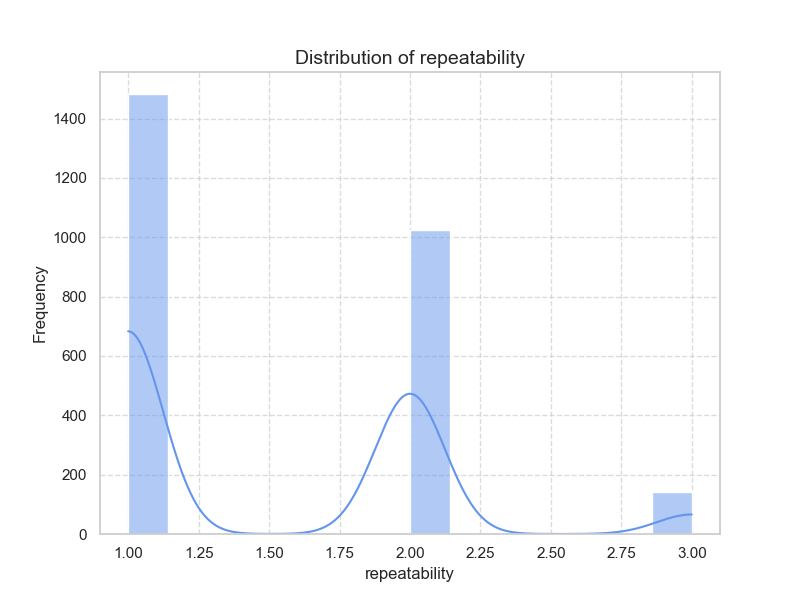

### Dataset Overview
The dataset contains 1,000 entries detailing various aspects of evaluated content, including attributes such as date, language, content type, title, creator ('by'), and ratings across three dimensions—overall performance, quality, and repeatability.

### Key Findings from Basic Analysis
1. **Dates**: A total of 1,000 unique entries spans over various dates, the most common date being '09-Feb-19' which occurs 6 times. The presence of multiple dates indicates that the dataset covers multiple evaluations carried out over time.
2. **Language**: There are 8 unique languages, with English being the most prevalent (395 entries). This indicates a possible cultural bias in the content evaluation.
3. **Content Type**: With 794 entries classified as 'movie', it demonstrates that most data points relate to film content. Five other types are relatively less documented, suggesting interest in expanding the types or deeper analysis within those other categories.
4. **Titles and Creators**: There are 918 unique titles, with 'Don' appearing most frequently (4 times). Meanwhile, 'Kiefer Sutherland' is the most common creator (47 entries) among 591 unique creators in total.
5. **Ratings Overview**:
   - Overall Ratings: Mean = 2.903 (std dev = 0.657) suggesting a generally moderate assessment.
   - Quality Ratings: Mean = 3.161 (std dev = 0.708) indicating slightly higher perceived quality.
   - Repeatability Ratings: Mean = 1.224 (std dev = 0.449) suggesting low repeatability in evaluations.

### Correlation Analysis
- Strong positive correlation between overall and quality ratings (0.775) indicates that higher quality ratings generally coincide with higher overall ratings.
- Moderate correlation between overall and repeatability (0.382) suggests some relationship between these variables, though it isn't strong enough to imply direct causation.

### Observations on Missing Data
- The 'by' column has 127 missing values (≈12.7% of the total). Other columns are complete.
- To address missing values in the 'by' column:
  - Impute missing values using strategies like filling with the mode or creating categories based on existing ratings.
  - If creator credibility is paramount, consider excluding entries with missing creator data from detailed analysis.

### Recommendations for Further Analysis
1. **Deeper Analysis of Ratings**:
   - Perform segment analysis on content type (movies vs. other types) and language to compare ratings across various demographics.
2. **Trend Analysis Over Time**:
   - Analyze changes in overall and quality ratings over time to identify trends and spikes in user sentiment.
3. **Creator Analysis**:
   - Investigate the relationship between specific creators and their overall and quality ratings to identify standout creators.
4. **Language Impact**:
   - Assess how language affects rating variations, particularly if translations or cultural biases play a role in overall assessment.

### Visualization Techniques
1. **Bar Charts**: Showing the distribution of ratings across content types—movies, documentaries, etc.
2. **Heatmaps**: Correlation matrix visualization to indicate relationships visually.
3. **Time Series Plots**: To track ratings over time for trends analysis.
4. **Boxplots**: For showcasing rating distributions by type or creator.

### Predictive Modeling Techniques
1. **Regression Analysis**:
   - Linear regression modeling on overall ratings based on quality and repeatability to understand impacts.
2. **Classification Models**:
   - Decision trees or random forests to classify content into expected overall ratings categories based on attributes like type, language, and creator.

### Limitations
- **Bias Due to Missing Data**: The missing creators might skew analysis towards particular creators, assuming certain biases.
- **Limited Entries Per Category**: Some categories have low entries (only 6 types) which may not provide a comprehensive overview if expanded.

### Outlier Handling
- Identify outliers in ratings using Z-scores or IQR (Interquartile Range), critical in understanding anomalies in data that could skew overall insights.
- Once identified, outliers can either be capped (winsorization) or analyzed separately for unique behaviors.

This analytical strategy provides insight into the content evaluations captured in the dataset and suggests potential pathways to enhance understanding, while being aware of and addressing data limitations.

